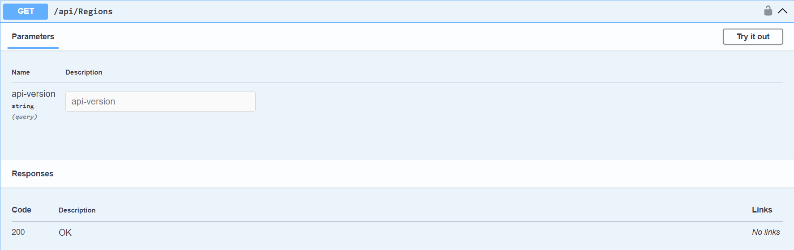
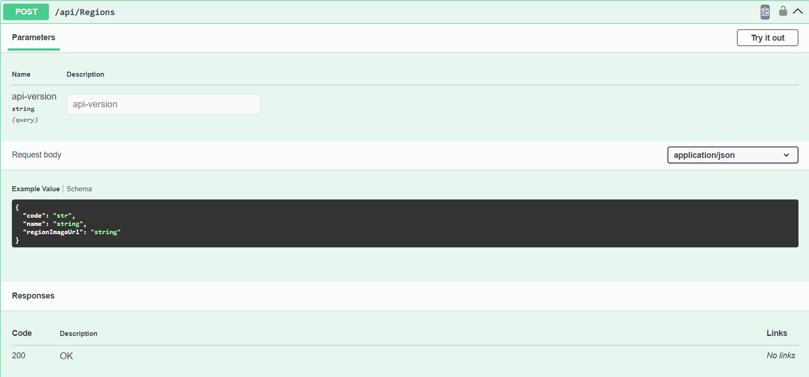
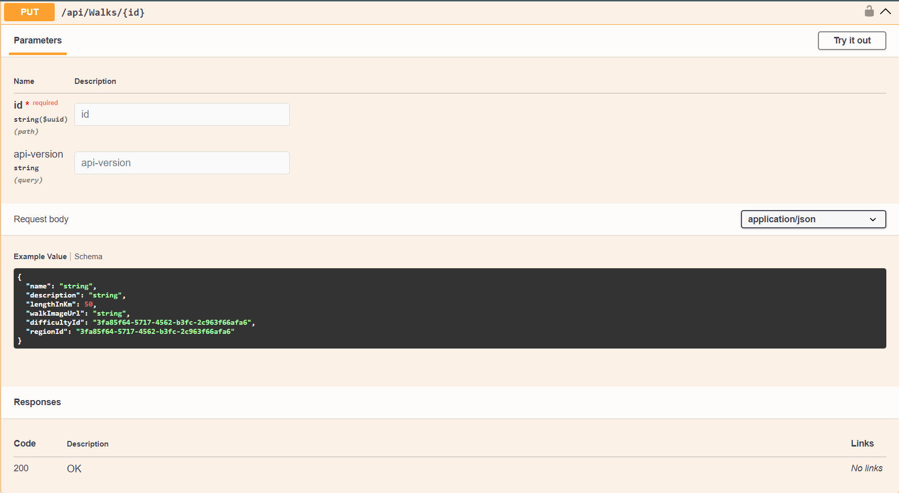
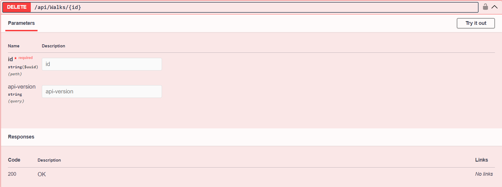

# New Zealand Walks & Regions API
## Project

This project provides a RESTful web API built using ASP.NET Core (.NET 8), Entity Framework Core (EF Core), and SQL Server. It empowers clients to manage data on New Zealand walks and regions, enabling them to:

- **Access** existing walk and region information

  

- **Create** new walks and regions

  

- **Update** existing walk and region details

  

- **Delete** walks and regions (subject to authorization)

  

## Features

- CRUD Operations (**Create**, **Read**, **Update**, **Delete**) for walks and regions

- Authentication (**JWT**) and Authorization for secure access control

- Object Mapping (**AutoMapper**) for efficient data transfer

- Asynchronous Programming (**async/await**) for improved performance and responsiveness

- Advanced Features: **Filtering**, **Sorting**, and **Pagination** for enhanced user experience

## Project Stack

- **Backend:** ASP.NET Core (.NET 8)

- **Database:** Microsoft SQL Server

- **Data Access:** Entity Framework Core (EF Core)

- **Object Mapping:** AutoMapper

- **Authentication:** JWT

## How to Run the Project

### Prerequisites:

- [.NET 8 SDK](https://dotnet.microsoft.com/en-us/download)

- [Microsoft SQL Server](https://www.microsoft.com/en-us/sql-server/sql-server-downloads) 

### Setup:

1. [Clone this repository.](https://github.com/tanvirtazwar/Project_NZWalks.git)
   ```
   Bash
   https://github.com/tanvirtazwar/Project_NZWalks.git
   ```

2. Open the solution file `.sln` in your preferred IDE.

3. Configure the database connection string in the appropriate configuration file.

4. Update any seed data or initial configuration settings as needed.

### Run:

1. Right-click on the project in your IDE and select `Run` or `Debug` (depending on your IDE).

2. The API will start and typically listen on a port like `http://localhost:5000` (the exact port may vary).

3. Use tools like Postman or curl to send HTTP requests to the API endpoints following the documented API specification (typically provided in a separate file like `Swagger.json` or using Swagger UI).

> [!NOTE]
> - Ensure the database is created and configured with the appropriate schema before running the project.
> - Consider implementing additional configuration options (e.g., environment variables) to manage database connections and other settings in different environments (development, testing, production).
> - Refer to the code itself and any additional documentation within the project for more detailed usage instructions and API endpoint specifications.